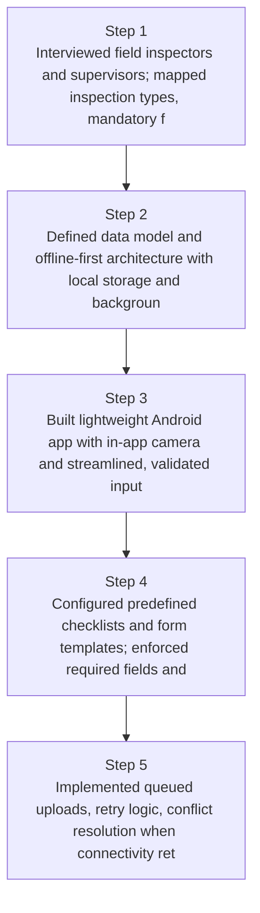
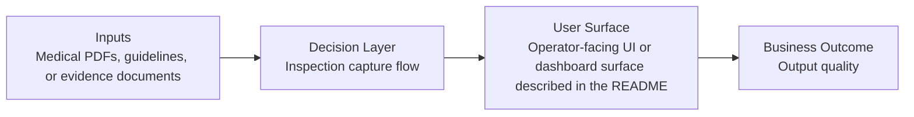
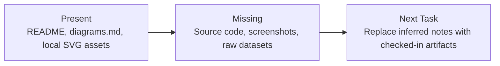

# Offline Inspection Capture Platform Diagrams

Generated on 2026-04-26T04:29:37Z from README narrative plus project blueprint requirements.

## Offline-first sync architecture

## Inspection capture flow

## Evidence Gap Map

